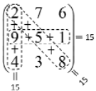

# Ejercicio 20
🔴 **Dificultad Alta**

Un cuadrado mágico 3 x 3 es una matriz 3 x 3 formada por números del 1 al 9 donde la
suma de sus filas, sus columnas y sus diagonales son idénticas. Crear un programa que
permita introducir un cuadrado por teclado y determine si este cuadrado es mágico o no.
El programa deberá comprobar que los números introducidos son correctos, es decir,
están entre el 1 y el 9.

