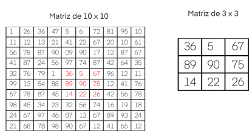

# Ejercicio 21
🔴 **Dificultad Alta**

Dadas dos matrices cuadradas de números enteros, la matriz M de 10x10 y la matriz P de
3x3, se solicita escribir un programa en el cual se compruebe si la matriz P está contenida
dentro de la matriz M. Para ello se debe verificar si entre todas las submatrices de 3x3
que se pueden formar en la matriz M, desplazándose por filas o columnas, existe al
menos una que coincida con la matriz P. En ese caso, el programa debe indicar la fila y la
columna de la matriz M en la cual empieza el primer elemento de la submatriz P.

Ejemplo:

Como podemos observar nuestra submatriz P se encuentra en la matriz M en los índices:  
4,4 - 4,5 - 4,6 - 5,4 - 5,5 - 5,6 - 6,4 - 6,5 - 6,6.